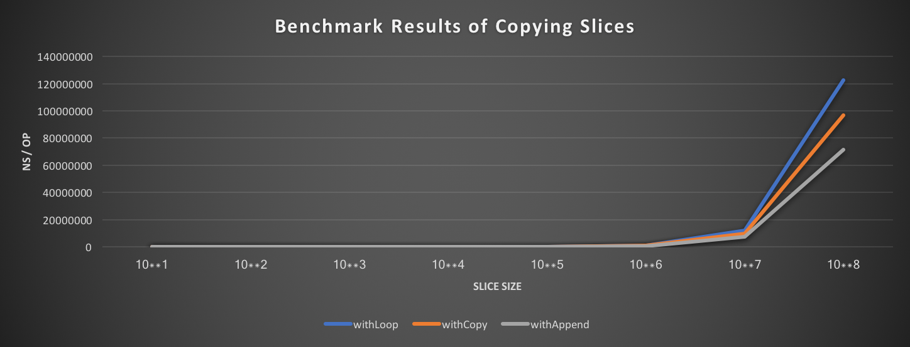

## Results

```bash
$ go test -bench . -benchmem
BenchmarkCopy/10*1_withLoop-4         	30000000	        38.6 ns/op	      80 B/op	       1 allocs/op
BenchmarkCopy/10*1_withCopy-4         	30000000	        37.8 ns/op	      80 B/op	       1 allocs/op
BenchmarkCopy/10*1_withAppend-4       	30000000	        42.8 ns/op	      80 B/op	       1 allocs/op
BenchmarkCopy/10*2_withLoop-4         	10000000	       179 ns/op	     896 B/op	       1 allocs/op
BenchmarkCopy/10*2_withCopy-4         	10000000	       141 ns/op	     896 B/op	       1 allocs/op
BenchmarkCopy/10*2_withAppend-4       	10000000	       148 ns/op	     896 B/op	       1 allocs/op
BenchmarkCopy/10*3_withLoop-4         	 1000000	      1452 ns/op	    8192 B/op	       1 allocs/op
BenchmarkCopy/10*3_withCopy-4         	 1000000	      1081 ns/op	    8192 B/op	       1 allocs/op
BenchmarkCopy/10*3_withAppend-4       	 1000000	      1081 ns/op	    8192 B/op	       1 allocs/op
BenchmarkCopy/10*4_withLoop-4         	  100000	     10507 ns/op	   81920 B/op	       1 allocs/op
BenchmarkCopy/10*4_withCopy-4         	  200000	      7859 ns/op	   81920 B/op	       1 allocs/op
BenchmarkCopy/10*4_withAppend-4       	  200000	      6140 ns/op	   81920 B/op	       1 allocs/op
BenchmarkCopy/10*5_withLoop-4         	   10000	    110424 ns/op	  802816 B/op	       1 allocs/op
BenchmarkCopy/10*5_withCopy-4         	   20000	     96171 ns/op	  802816 B/op	       1 allocs/op
BenchmarkCopy/10*5_withAppend-4       	   20000	     61012 ns/op	  802816 B/op	       1 allocs/op
BenchmarkCopy/10*6_withLoop-4         	    2000	   1074627 ns/op	 8003584 B/op	       1 allocs/op
BenchmarkCopy/10*6_withCopy-4         	    2000	    944862 ns/op	 8003584 B/op	       1 allocs/op
BenchmarkCopy/10*6_withAppend-4       	    2000	    543883 ns/op	 8003584 B/op	       1 allocs/op
BenchmarkCopy/10*7_withLoop-4         	     100	  11845974 ns/op	80003072 B/op	       1 allocs/op
BenchmarkCopy/10*7_withCopy-4         	     200	   9444783 ns/op	80003072 B/op	       1 allocs/op
BenchmarkCopy/10*7_withAppend-4       	     200	   7172734 ns/op	80003072 B/op	       1 allocs/op
BenchmarkCopy/10*8_withLoop-4         	      10	 122678266 ns/op	800006144 B/op	       1 allocs/op
BenchmarkCopy/10*8_withCopy-4         	      20	  96970846 ns/op	800006144 B/op	       1 allocs/op
BenchmarkCopy/10*8_withAppend-4       	      20	  71296331 ns/op	800006144 B/op	       1 allocs/op
PASS
ok  	github.com/keijiyoshida/goperf/slice_copy	44.148s
```


